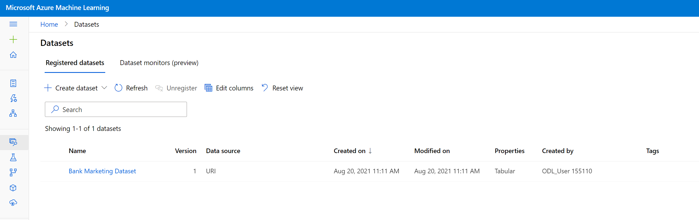

# Project: Operationalizing Machine Learning

Diagram of the process:

- AutoML Model
- Deploy Best Model
- Enable Application Insight
- Build Swagger Documentation
- Consume the endpoint
- Compute the benchmark performance of the endpoint
- Build a pipeline
- Publish the pipeline
- Trigger the pipeline with an api request
- Document everythig and record the screencast 

## Automated ML Experiment and Endpoint

I've started by creating an AutoML run using the *Bank Marketing* dataset provided.

The dataset was first registered into the azure ml workspace to make it available to other services like automl or pipelines and it's found int the *registered datasets* section of the datasets page.



then an *automl* run was created and run using the code provided into `lancia\set_up_part1.ipynb`

```{python}
from azureml.train.automl import AutoMLConfig

automl_settings = {
    "experiment_timeout_minutes": 20,
    "max_concurrent_iterations": 5,
    "primary_metric" : 'AUC_weighted'
}
automl_config = AutoMLConfig(compute_target=cpu_cluster,
                             task = "classification",
                             training_data=dataset,
                             label_column_name="y",   
                             path = "./test",
                             enable_early_stopping= True,
                             featurization= 'auto',
                             debug_log = "automl_errors.log",
                             **automl_settings)
                            
from azureml.core import Experiment


experiment_name = 'AZMLE-project2-step2'
experiment = Experiment(ws, experiment_name)

from azureml.widgets import RunDetails
from azureml.core.run import Run

automl = experiment.submit(automl_config)
RunDetails(automl).show()
automl.wait_for_completion(show_output=True)

```

resulting in an experiment run called `AZMLE-project2-step2`, we can see the detail of the run in the screenshot below displaying the parameters of the run and the best model achieved in the following screenshot:


Taking a deep dive into the best model achieved by looking at the model tab we can see that is voting ensemble as in the previous project.


The model was deploy first without any insight enabled by clicking on the deploy button from the experiment run to an *Azure Container Instance* and with the authentication enabled:

After some time the endpoint was fully deployed resulting in an *healthy* status as displayed in the screenshot of the endopoint details below.


then using the code in `lancia\enable_insight.py` insight were enabled

```{python}
from azureml.core import Workspace
from azureml.core.webservice import Webservice

# Requires the config to be downloaded first to the current working directory
ws = Workspace.from_config()

# Set with the deployment name
name = "bank-marketing"

# Load existing web service
service = Webservice(name=name, workspace=ws)

# Enable Application Insights
service.update(enable_app_insights=True)
```

forcing an update of the endpoint with the insight enabled. After some time the model will transitions again to an healthy status, as shown in the screenshot below.


**Important** the code requires to authenticate to the correct workspace thus a `config.json` file is needed in the same or parents directory.

With a endopoint up and running we can use the file `log.py` to retrieve the logs, after updating the python script with the correct endpoint name and using the `config.json` file to point to the correct workspace. The result is shown here:


When the endpoint is up and running we can use the swagger.json file with the Swagger tool to get info and documentation about the exposed REST API.

After running a local container with the swagger tool on the port 9080, we created a webserver to expose the swagger.json file from the same domain as the swagger service and obtained, using the swagger tool the following reults:


This is the description of the API exposed and how to build a correct payload for the requests thus obtaing the predictions from the model.

I've modified the `endopoint.py` adding the authentication parameters required for the API **and** by rearranging the payload of the request to match the signature from the swagger doc.

Without this change the system will produce an unhandled exception.

```{python}
import requests
import json

# URL for the web service, should be similar to:
# 'http://8530a665-66f3-49c8-a953-b82a2d312917.eastus.azurecontainer.io/score'
scoring_uri = 'http://469741b0-acef-4a4e-a46d-845c72d93509.southcentralus.azurecontainer.io/score'
# If the service is authenticated, set the key or token
key = 'EuNmM1Ccr2TniZYvreexh75h9BzEA0S4'

# Two sets of data to score, so we get two results back
data = {"data":
        [
          {
            "age": 17,
            "job": "blue-collar",
            "marital": "married",
            "education": "university.degree",
            "default": "no",
            "housing": "yes",
            "loan": "yes",
            "contact": "cellular",
            "month": "may",
            "day_of_week": "mon",
            "duration": 971,
            "campaign": 1,
            "pdays": 999,
            "previous": 1,
            "poutcome": "failure",
            "emp.var.rate": -1.8,
            "cons.price.idx": 92.893,
            "cons.conf.idx": -46.2,
            "euribor3m": 1.299,
            "nr.employed": 5099.1
          }
      ]
    }
# Convert to JSON string
input_data = json.dumps(data)
with open("data.json", "w") as _f:
    _f.write(input_data)

# Set the content type
headers = {'Content-Type': 'application/json'}
# If authentication is enabled, set the authorization header
headers['Authorization'] = f'Bearer {key}'

# Make the request and display the response
resp = requests.post(scoring_uri, input_data, headers=headers)
print(resp.json())
```

Using this modified scripts i can consume the endpoint by making a post request using a json payload and obtain the prediction, like in the following screenshot:


This script also produced a `data.json` with the payload of the request. The json file is the used to compute the benchmark of this endpoint using the apache bench tool.

First i've modified the `benchmark.sh` file to add the correct URI and auth key, then i've run it obtaing the following results:


This contains aggregated statiscs on the response time for subsequent request giving us an idea of the performance of this API.

## Pipeline

Using the provided notebook we created an Azure pipeline and we published it. The creation is done with the follwing SDK command, after defining an *automl_step*.

```{python}
from azureml.pipeline.core import Pipeline
pipeline = Pipeline(
    description="pipeline_with_automlstep",
    workspace=ws,    
    steps=[automl_step])
```
thus resulting in a pipeline created and visibile in the pipelines section, like in the following screenshot.
.

The pipelin did run and the *automl_step* did find a *best model* being again the same *Voting Ensamble*.


After that we exposed that pipeline, by running the following piece of code: 

```{python}
published_pipeline = pipeline_run.publish_pipeline(
    name="Bankmarketing Train", description="Training bankmarketing pipeline", version="1.0")

published_pipeline
```

creating an endpoint that can trigger another run of the pipeline, as you can see in the endpoints tab of the pipeline section of the workspace. 


Taking a deeper look at the pipeline we can see that is composed of two steps:

* the dataset
* the automl module

look at the following screenshot: 


We can also see in the right part that the pipeline is exposed with a REST endpoint. 


Finally we tested this endpoint by calling it with a post request:

```{python}
import requests

rest_endpoint = published_pipeline.endpoint
response = requests.post(rest_endpoint, 
                         headers=auth_header, 
                         json={"ExperimentName": "pipeline-rest-endpoint"}
                        )

try:
    response.raise_for_status()
except Exception:    
    raise Exception("Received bad response from the endpoint: {}\n"
                    "Response Code: {}\n"
                    "Headers: {}\n"
                    "Content: {}".format(rest_endpoint, response.status_code, response.headers, response.content))

run_id = response.json().get('Id')
print('Submitted pipeline run: ', run_id)

```

this triggers another run of that pipelines and log everything under a new experiment called: `pipeline-rest-endpoint`

If we make from a jupyter notebook we can see in the widjet the status of the run and the structure of the pipeline


and the submitted experiment run  in the azure ml studio


## Future Improvements

* Analyze the hints from the *data guardrail* signaling us that the dataset is unbalanced and then apply some techniques to handle the unbalance, like SMOTE. 

* Add more steps to the pipeline with some features engegneering steps to try boost the predictive performances

* Automate the process of triggering the pipeline with some CI/CD tools inside github

## Screencast link

https://youtu.be/TujTFvjqDgs